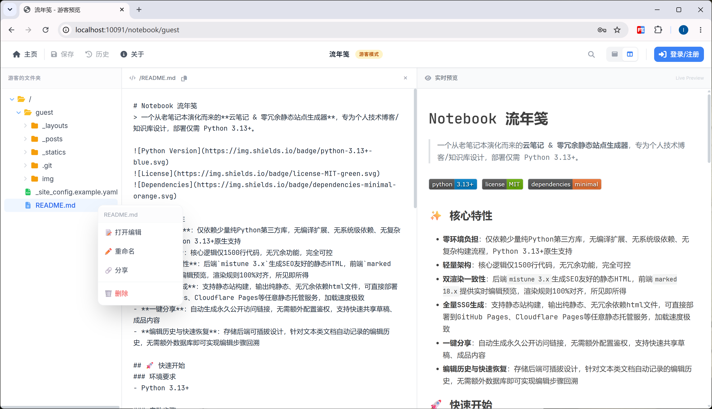
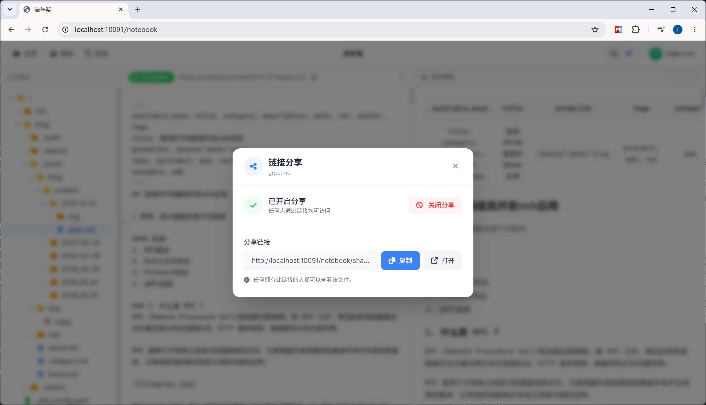
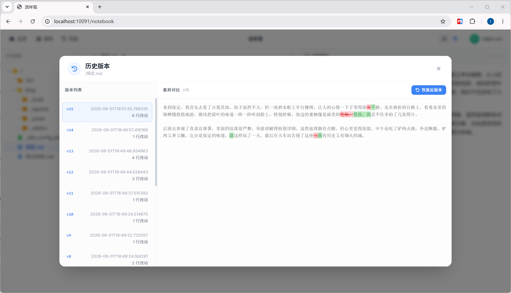

# Notebook 流年笺
> 一个从老笔记本演化而来的**云笔记 & 零冗余静态站点生成器**，专为个人技术博客/知识库设计，部署仅需 Python 3.13+。


## ✨ 核心特性
- **零环境负担**：Python 3.13+原生支持，基于文件系统，仅依赖少量第三方库，无编译扩展、系统级依赖、复杂构建流程
- **轻量架构**：核心逻辑仅1500行代码
- **可插拔存储**：后端存储统一抽象接口，默认使用本地文件系统，NAS挂载目录、S3兼容对象存储（含AWS S3、Cloudflare R2、MinIO等）等可无缝迁移
- **编辑历史与快速恢复**：前后端增量同步、持久化历史快照，无惧手滑和误操作
- **双渲染一致性**：后端`mistune 3.x`生成SEO友好的静态HTML，前端`marked 18.x`提供实时编辑预览，渲染规则100%对齐，所见即所得
- **全量SSG生成**：支持构建静态站点以部署到GitHub Pages、Cloudflare Pages等任意静态托管服务，加载速度极致
- **一键分享**：自动生成永久公开访问链接，无需额外配置鉴权，支持快速共享草稿、成品内容

## 🚀 快速开始
### 环境要求
- Python 3.13+

### 启动步骤

#### 1. 克隆仓库
```bash
git clone git@github.com:cl-ei/notebook-liunianjian.git

cd notebook-liunianjian
```

#### 2. 安装依赖

```bash
pip install -r requirements.txt
```

#### 3. 启动服务

```bash
python run.py
```

启动成功后访问：`http://localhost:10091/notebook`

## 🔍 预览





## 🗺️ Roadmap
- [ ] **v2.1**：回收站/目录保护
- [ ] **v2.1**：一键导出全站文件
- [ ] **v2.1**：PDF生成
- [ ] **v2.1**：打印模式
- [ ] **v2.1**：命令管道/webhook
- [ ] **v2.1**：暗系主题，夜间模式

## ❌ 明确不支持的功能
为避免臃肿、偏离「零依赖、轻量」的定位，以下功能**永久不支持**：
1. 数据库依赖：所有数据存储在文件系统，无用户认证库、无评论库、无统计库
2. 多用户协作：仅支持单用户/单会话编辑，无实时协作、无权限体系
3. 复杂插件系统：仅提供有限的钩子机制，不过度扩展
4. 非UTF-8编码：所有文件强制UTF-8编码
5. 不支持富媒体自动处理：不内置图片压缩、WebP转换、视频转码等需要C扩展的能力

## 📄 License
MIT License，详见[LICENSE](./LICENSE)文件。