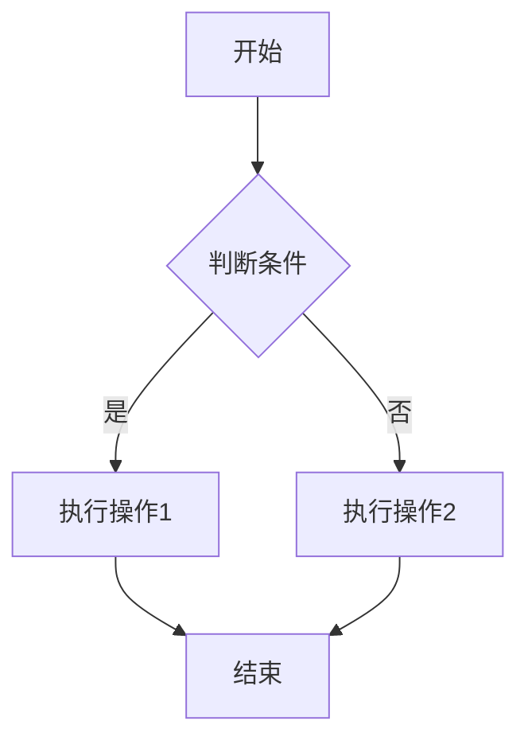
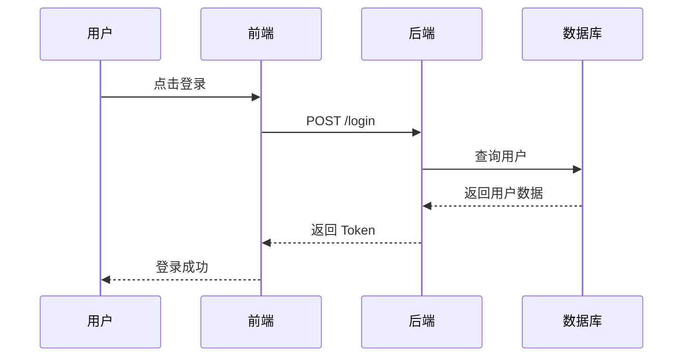
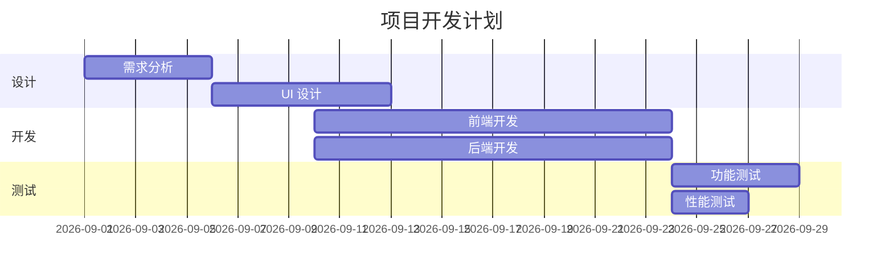
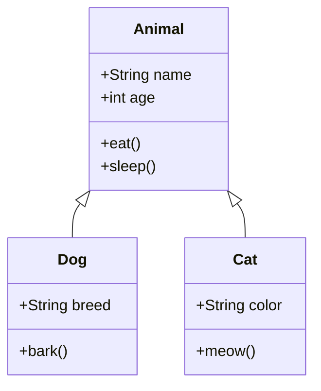
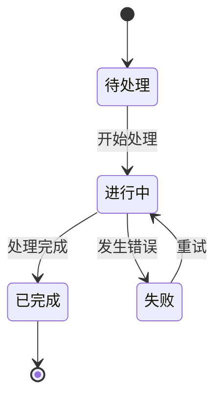
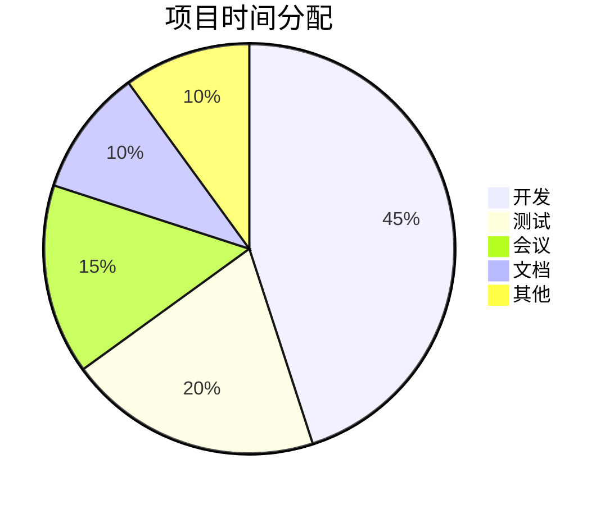

# Markdown 预览器测试文件

> 本文件用于测试 Markdown 预览器的渲染效果，尽可能覆盖各种常用格式与扩展语法。
> 如果您的预览器支持，应该能正确渲染以下所有内容。

**文档信息**

- **文件名**：`markdown-preview-test.md`
- **用途**：预览器兼容性测试
- **最后更新**：2026-08-29
- **覆盖语法**：CommonMark + 常用扩展（GFM 等）

---

## 目录

1. [标题层级](#标题层级)
2. [段落与文本格式](#段落与文本格式)
3. [引用块](#引用块)
4. [列表](#列表)
5. [代码](#代码)
6. [分割线](#分割线)
7. [链接与图片](#链接与图片)
8. [表格](#表格)
9. [任务列表](#任务列表)
10. [HTML 混合](#html-混合)
11. [数学公式（如支持）](#数学公式如支持)
12. [图表（如支持）](#图表如支持)
13. [脚注（如支持）](#脚注如支持)
14. [定义列表（如支持）](#定义列表如支持)
15. [长文本内容](#长文本内容)

---

## 标题层级

# 一级标题（H1）

## 二级标题（H2）

### 三级标题（H3）

#### 四级标题（H4）

##### 五级标题（H5）

###### 六级标题（H6）

> 注意：Markdown 标准只定义到 H6，更深的层级通常不支持。

---

## 段落与文本格式

这是一个普通段落。Markdown 中的段落由一个或多个连续的文本行组成，段落之间需要用空行分隔。

这是第二个段落，用来演示段落间距。

### 行内文本格式

| 格式类型 | 写法 | 渲染效果 |
|----------|------|----------|
| 加粗 | `**加粗**` | **加粗** |
| 斜体 | `*斜体*` | *斜体* |
| 加粗+斜体 | `***强调***` | ***强调*** |
| 删除线 | `~~删除线~~` | ~~删除线~~ |
| 行内代码 | `` `code` `` | `code` |
| 下划线 | `<u>下划线</u>` | <u>下划线</u> |
| 高亮 | `==高亮==` | ==高亮==（部分预览器） |
| 下标 | `H~2~O` | H~2~O（部分预览器） |
| 上标 | `E = mc^2^` | E = mc^2^（部分预览器） |

### 混合格式示例

这是一段**加粗文本**，其中包含*斜体*和`行内代码`，还有一个~~被删除的词~~。你可以在同一段落中~~混合~~使用**多种 *格式***，甚至可以嵌套 `code with **bold** inside`（虽然行内代码内的格式通常不会生效）。

### 转义字符

以下字符需要使用反斜杠转义：`\* \_ \[ \] \( \) \# \+ \- \. \!`

- 星号：\*
- 下划线：\_
- 井号：\#
- 反引号：\`
- 感叹号：\!

---

## 引用块

> 这是一个简单的引用块。
> 第二行继续引用。

> 引用块可以嵌套：
>
> > 嵌套引用（二级）
> >
> > > 嵌套引用（三级）
> >
> 返回一级引用

> 引用块中也可以包含**格式**、`代码`和其他元素：
>
> 1. 列表项一
> 2. 列表项二
>
> | 表格 | 在引用中 |
> |------|----------|
> | A    | B        |

---

## 列表

### 无序列表

- 一级项目 A
- 一级项目 B
    - 二级项目 B.1
    - 二级项目 B.2
        - 三级项目 B.2.1
        - 三级项目 B.2.2
    - 二级项目 B.3
- 一级项目 C

不同符号也可以混用（但通常统一为一种）：

* 使用星号
- 使用减号
+ 使用加号

### 有序列表

1. 第一项
2. 第二项
    1. 子项 2.1
    2. 子项 2.2
        1. 深层子项 2.2.1
        2. 深层子项 2.2.2
    3. 子项 2.3
3. 第三项

> **提示**：有序列表的序号实际上可以全部写成 `1.`，渲染时会自动编号。

### 复杂列表（混合内容）

1. **项目一**：描述文本

   这是一个段落，属于项目一的内容。

    - 子列表项 A
    - 子列表项 B

   ```python
   # 代码块也可以放在列表里
   print("hello")
   ```

2. **项目二**：另一段描述

   > 引用也可以嵌套在列表里

3. **项目三**：包含表格

   | 列1 | 列2 |
      |-----|-----|
   | a   | b   |

---

## 代码

### 行内代码

使用 `print("Hello, World!")` 可以输出问候语。变量名如 `user_name` 和函数名如 `calculate_total()` 通常用行内代码表示。

### 代码块（无语言标注）

```
这是一个纯文本代码块
没有语法高亮
可以包含任何内容：<>&"'
```

### 代码块（带语言标注）

#### Python

```python
"""
模块文档字符串
"""
import os
import sys
from typing import Optional, List, Dict, Any


class Person:
    """表示一个人的类。"""

    def __init__(self, name: str, age: Optional[int] = None):
        self.name = name
        self.age = age

    def greet(self, greeting: str = "Hello") -> str:
        """返回问候语。"""
        return f"{greeting}, my name is {self.name}!"

    @property
    def is_adult(self) -> bool:
        """判断是否成年。"""
        return self.age is not None and self.age >= 18


def fibonacci(n: int) -> List[int]:
    """返回斐波那契数列前 n 项。"""
    if n <= 0:
        return []
    elif n == 1:
        return [0]
    elif n == 2:
        return [0, 1]

    seq = [0, 1]
    for i in range(2, n):
        seq.append(seq[i - 1] + seq[i - 2])
    return seq


# 主程序
if __name__ == "__main__":
    people = [
        Person("Alice", 30),
        Person("Bob", 15),
        Person("Charlie", 25),
    ]

    for person in people:
        print(person.greet())
        print(f"  Is adult: {person.is_adult}")

    print(f"\nFibonacci(10): {fibonacci(10)}")
```

#### JavaScript / TypeScript

```typescript
/**
 * 用户服务类
 */
export class UserService {
  private users: Map<string, User> = new Map();

  /**
   * 创建新用户
   */
  async createUser(data: CreateUserDto): Promise<User> {
    const id = this.generateId();
    const user: User = {
      id,
      ...data,
      createdAt: new Date(),
      updatedAt: new Date(),
    };

    this.users.set(id, user);
    return user;
  }

  /**
   * 根据 ID 查找用户
   */
  async findById(id: string): Promise<User | null> {
    return this.users.get(id) ?? null;
  }

  /**
   * 更新用户信息
   */
  async updateUser(id: string, updates: Partial<User>): Promise<User> {
    const user = await this.findById(id);
    if (!user) {
      throw new Error(`User ${id} not found`);
    }

    const updated = {
      ...user,
      ...updates,
      updatedAt: new Date(),
    };

    this.users.set(id, updated);
    return updated;
  }

  private generateId(): string {
    return Math.random().toString(36).substring(2, 15);
  }
}

interface User {
  id: string;
  name: string;
  email: string;
  createdAt: Date;
  updatedAt: Date;
}

interface CreateUserDto {
  name: string;
  email: string;
}
```

#### SQL

```sql
-- 创建用户表
CREATE TABLE users (
    id          SERIAL PRIMARY KEY,
    username    VARCHAR(50)  NOT NULL UNIQUE,
    email       VARCHAR(255) NOT NULL UNIQUE,
    password    VARCHAR(255) NOT NULL,
    created_at  TIMESTAMP    NOT NULL DEFAULT CURRENT_TIMESTAMP,
    updated_at  TIMESTAMP    NOT NULL DEFAULT CURRENT_TIMESTAMP
);

-- 创建索引
CREATE INDEX idx_users_email ON users(email);

-- 插入数据
INSERT INTO users (username, email, password)
VALUES
    ('alice', 'alice@example.com', '$2b$10$...'),
    ('bob',   'bob@example.com',   '$2b$10$...'),
    ('charlie','charlie@example.com','$2b$10$...');

-- 复杂查询
SELECT
    u.id,
    u.username,
    u.email,
    COUNT(o.id) AS order_count,
    SUM(o.total) AS total_spent
FROM users u
LEFT JOIN orders o ON o.user_id = u.id
WHERE u.created_at >= '2026-01-01'
GROUP BY u.id, u.username, u.email
HAVING COUNT(o.id) > 0
ORDER BY total_spent DESC
LIMIT 10;
```

#### CSS

```css
/* 响应式卡片样式 */
.card {
  display: flex;
  flex-direction: column;
  padding: 1.5rem;
  border-radius: 0.75rem;
  background: #ffffff;
  box-shadow: 0 4px 6px -1px rgba(0, 0, 0, 0.1),
              0 2px 4px -1px rgba(0, 0, 0, 0.06);
  transition: transform 0.2s ease, box-shadow 0.2s ease;
}

.card:hover {
  transform: translateY(-4px);
  box-shadow: 0 20px 25px -5px rgba(0, 0, 0, 0.1),
              0 10px 10px -5px rgba(0, 0, 0, 0.04);
}

@media (max-width: 768px) {
  .card {
    padding: 1rem;
  }
}
```

#### JSON

```json
{
  "name": "markdown-test",
  "version": "1.0.0",
  "description": "A test file for Markdown previewers",
  "config": {
    "enabled": true,
    "retry": {
      "max": 3,
      "delay": 1000
    },
    "features": ["headings", "lists", "code", "tables"]
  },
  "users": [
    { "id": 1, "name": "Alice", "roles": ["admin", "editor"] },
    { "id": 2, "name": "Bob",   "roles": ["viewer"] }
  ],
  "metadata": null,
  "tags": ["test", "markdown", "preview"]
}
```

#### Shell / Bash

```bash
#!/bin/bash
# 部署脚本示例

set -euo pipefail

# 环境变量
export NODE_ENV="production"
export PORT="${PORT:-3000}"

# 颜色定义
GREEN='\033[0;32m'
RED='\033[0;31m'
NC='\033[0m'

# 函数：打印成功信息
log_success() {
    echo -e "${GREEN}[✓]${NC} $1"
}

# 函数：打印错误信息
log_error() {
    echo -e "${RED}[✗]${NC} $1" >&2
}

# 主流程
main() {
    echo "=== 开始部署 ==="

    # 1. 安装依赖
    log_success "安装依赖..."
    npm ci --production || { log_error "依赖安装失败"; exit 1; }

    # 2. 构建项目
    log_success "构建项目..."
    npm run build || { log_error "构建失败"; exit 1; }

    # 3. 启动服务
    log_success "启动服务..."
    pm2 start ecosystem.config.js --env production

    log_success "部署完成！"
}

main "$@"
```

#### Go

```go
package main

import (
    "context"
    "fmt"
    "log"
    "net/http"
    "os"
    "os/signal"
    "syscall"
    "time"
)

// Server 表示一个 HTTP 服务器
type Server struct {
    addr   string
    mux    *http.ServeMux
    logger *log.Logger
}

// NewServer 创建一个新的服务器实例
func NewServer(addr string) *Server {
    mux := http.NewServeMux()
    mux.HandleFunc("/", homeHandler)
    mux.HandleFunc("/health", healthHandler)

    return &Server{
        addr:   addr,
        mux:    mux,
        logger: log.New(os.Stdout, "[server] ", log.LstdFlags),
    }
}

func homeHandler(w http.ResponseWriter, r *http.Request) {
    if r.URL.Path != "/" {
        http.NotFound(w, r)
        return
    }
    fmt.Fprintln(w, "Welcome to the home page!")
}

func healthHandler(w http.ResponseWriter, r *http.Request) {
    w.WriteHeader(http.StatusOK)
    fmt.Fprintln(w, `{"status":"ok"}`)
}

// Start 启动服务器并支持优雅关闭
func (s *Server) Start() error {
    srv := &http.Server{
        Addr:    s.addr,
        Handler: s.mux,
    }

    // 在 goroutine 中启动服务器
    go func() {
        s.logger.Printf("服务器启动在 %s", s.addr)
        if err := srv.ListenAndServe(); err != nil && err != http.ErrServerClosed {
            s.logger.Fatalf("服务器错误: %v", err)
        }
    }()

    // 等待中断信号
    quit := make(chan os.Signal, 1)
    signal.Notify(quit, syscall.SIGINT, syscall.SIGTERM)
    <-quit

    s.logger.Println("正在关闭服务器...")

    // 优雅关闭（30 秒超时）
    ctx, cancel := context.WithTimeout(context.Background(), 30*time.Second)
    defer cancel()

    return srv.Shutdown(ctx)
}

func main() {
    server := NewServer(":8080")
    if err := server.Start(); err != nil {
        log.Fatal(err)
    }
}
```

#### Rust

```rust
use std::collections::HashMap;
use std::sync::{Arc, Mutex};
use std::thread;

/// 线程安全的计数器
struct Counter {
    value: Mutex<u64>,
}

impl Counter {
    fn new() -> Self {
        Self {
            value: Mutex::new(0),
        }
    }

    fn increment(&self) {
        let mut guard = self.value.lock().unwrap();
        *guard += 1;
    }

    fn get(&self) -> u64 {
        *self.value.lock().unwrap()
    }
}

fn main() {
    let counter = Arc::new(Counter::new());
    let mut handles = vec![];

    for i in 0..10 {
        let counter_clone = Arc::clone(&counter);
        let handle = thread::spawn(move || {
            for _ in 0..100 {
                counter_clone.increment();
            }
            println!("Thread {} finished", i);
        });
        handles.push(handle);
    }

    for handle in handles {
        handle.join().unwrap();
    }

    println!("Final count: {}", counter.get());

    // 使用 HashMap
    let mut scores = HashMap::new();
    scores.insert(String::from("Blue"), 10);
    scores.insert(String::from("Yellow"), 50);

    for (key, value) in &scores {
        println!("{}: {}", key, value);
    }
}
```

---

## 分割线

以下是三种等价的分割线写法：

---

**********

___

---

## 链接与图片

### 普通链接

- [百度](https://www.baidu.com)
- [GitHub](https://github.com)
- [MDN Web Docs](https://developer.mozilla.org)

### 带标题的链接

- [Google](https://www.google.com "Google 搜索")
- [Rust 官网](https://www.rust-lang.org "Rust 编程语言")

### 引用式链接

[baidu]: https://www.baidu.com "百度"
[github]: https://github.com "GitHub"

这里是 [百度][baidu] 和 [GitHub][github] 的引用式链接。

### 自动链接

- <https://www.example.com>
- <email@example.com>

### 图片

#### 普通图片


#### 带标题的图片


#### 引用式图片

[logo]: https://via.placeholder.com/200x200.png?text=LOGO

![网站 Logo][logo]

### 图片与链接组合

[](https://example.com)

---

## 表格

### 基础表格

| 左对齐 | 居中对齐 | 右对齐 |
|:--------|:--------:|--------:|
| 内容 A  |   内容 B |   内容 C |
| 较长的内容单元格 |    中    |    123 |
| 短      |   较长内容   |  4567.89 |

### 复杂表格

| 功能 | 状态 | 版本 | 备注 |
|------|:----:|:----:|------|
| 标题 | ✅ | v1.0 | 支持 H1-H6 |
| 列表 | ✅ | v1.0 | 有序/无序/任务列表 |
| 代码块 | ✅ | v1.0 | 语法高亮 |
| 表格 | ⚠️ | v1.2 | 部分预览器支持扩展 |
| 数学公式 | ❌ | - | 需要 KaTeX/MathJax |
| 图表 | ❌ | - | 需要 Mermaid 支持 |

### 表格内的格式

| 类型 | 示例 | 说明 |
|------|------|------|
| 加粗 | **重要** | 强调文本 |
| 斜体 | *注意* | 轻微强调 |
| 代码 | `npm install` | 命令或代码 |
| 链接 | [点击](https://example.com) | 超链接 |
| 删除线 | ~~废弃~~ | 不再推荐 |

### 宽表格（测试水平滚动）

| ID | 用户名 | 邮箱地址 | 注册时间 | 最后登录 | 状态 | 角色 | 部门 | 备注 |
|----|--------|----------|----------|----------|------|------|------|------|
| 1 | alice_smith | alice@example.com | 2025-01-15 08:30:00 | 2026-08-28 14:22:10 | active | admin | engineering | 超级管理员 |
| 2 | bob_jones | bob@example.com | 2025-02-20 10:15:00 | 2026-08-27 09:45:33 | active | editor | marketing | 内容编辑 |
| 3 | charlie_brown | charlie@example.com | 2025-03-10 16:45:00 | 2026-08-25 20:10:55 | inactive | viewer | sales | 已离职 |

---

## 任务列表

### 项目计划

- [x] 需求分析
- [x] 系统设计
- [x] 数据库建模
- [ ] 后端 API 开发
    - [x] 用户模块
    - [x] 认证模块
    - [ ] 订单模块
        - [ ] 创建订单
        - [ ] 取消订单
        - [ ] 退款处理
    - [ ] 支付模块
- [ ] 前端开发
    - [ ] 页面布局
    - [ ] 组件开发
    - [ ] 状态管理
- [ ] 测试
    - [ ] 单元测试
    - [ ] 集成测试
    - [ ] 端到端测试
- [ ] 部署上线

### 个人待办

- [x] 早起跑步
- [x] 阅读 30 分钟
- [ ] 完成工作报告
- [ ] 回复邮件
- [ ] 预约牙医
- [ ] 买菜做饭

---

## 表情符号与特殊字符

### Emoji（如支持）

常见的 emoji：🚀 🎉 ⭐ 💡 ✅ ❌ ⚠️ 📝 🔥 💻 🐛 🎯 🏆

### 特殊字符

© ® ™ ° ± × ÷ ≠ ≤ ≥ ∞ ∑ ∏ ∫ √ ∂ ∆ ∇ α β γ δ ε ζ η θ
← → ↑ ↓ ↔ ⇐ ⇒ ⇑ ⇓ « » – — … · • ○ ● ★ ☆ ☀ ☁ ☂ ☃ ☎ ☏

### Unicode 示例

- 中文：你好，世界！
- 日文：こんにちは、世界！
- 韩文：안녕하세요, 세계!
- 阿拉伯文：مرحبا بالعالم
- 俄文：Привет, мир!
- 希腊文：Γειά σου, κόσμε!
- 泰文：สวัสดีชาวโลก
- 希伯来文：שלום עולם

---

## HTML 混合

Markdown 支持直接嵌入 HTML 标签。

<div style="background: #f0f8ff; border: 2px solid #4169e1; border-radius: 8px; padding: 16px; margin: 16px 0;">
  <h4 style="color: #4169e1; margin-top: 0;">HTML 信息框</h4>
  <p>这是一个使用 HTML <code>div</code> 创建的信息框，可以在 Markdown 中嵌入任意 HTML。</p>
  <button style="background: #4169e1; color: white; border: none; padding: 8px 16px; border-radius: 4px; cursor: pointer;">点击按钮</button>
</div>

<details>
<summary><strong>点击展开/折叠（details/summary）</strong></summary>
<p>这是折叠面板的内容。</p>
<p>可以包含多个段落。</p>
<ul>
<li>列表项</li>
<li>另一个列表项</li>
</ul>
</details>

<center>
<p><strong>居中的文本</strong></p>
<small>使用 HTML 的 center 标签</small>
</center>

<hr>

<p align="right">
  <em>右对齐的文本</em>
</p>

<!-- 这是 HTML 注释，通常预览器不会显示 -->

---

## 数学公式（如支持）

### 行内公式

当 $a \neq 0$ 时，二次方程 $ax^2 + bx + c = 0$ 的解为？（这里测试一下不想行内解析的情况 \$ a \neq 0 \$ ？）：

### 块级公式

$$
x = \frac{-b \pm \sqrt{b^2 - 4ac}}{2a}
$$

### 更多公式示例

**欧拉公式：**

$$
e^{i\pi} + 1 = 0
$$

**牛顿-莱布尼茨公式：**

$$
\int_{a}^{b} f(x) \, dx = F(b) - F(a)
$$

**贝叶斯定理：**

$$
P(A|B) = \frac{P(B|A) \cdot P(A)}{P(B)}
$$

**矩阵：**

$$
\begin{pmatrix}
a_{11} & a_{12} & \cdots & a_{1n} \\
a_{21} & a_{22} & \cdots & a_{2n} \\
\vdots & \vdots & \ddots & \vdots \\
a_{m1} & a_{m2} & \cdots & a_{mn}
\end{pmatrix}
$$

**求和与求积：**

$$
\sum_{i=1}^{n} i = \frac{n(n+1)}{2}
$$

$$
\prod_{i=1}^{n} i = n!
$$

**极限：**

$$
\lim_{n \to \infty} \left(1 + \frac{1}{n}\right)^n = e
$$

**积分：**

$$
\oint_C \mathbf{B} \cdot d\mathbf{l} = \mu_0 \iint_S \mathbf{J} \cdot d\mathbf{S}
$$

---

## 图表（如支持 Mermaid）

### 流程图



### 时序图



### 甘特图



### 类图



### 状态图



### 饼图



---

## 脚注（如支持）

这是一个带脚注的句子[^1]。这是另一个引用同一脚注的句子[^1]。

这是第二个脚注[^2]。

[^1]: 这是第一个脚注的内容。可以包含**格式**、[链接](https://example.com)和代码 `code`。
[^2]: 这是第二个脚注的内容。

---

## 定义列表（如支持）

术语 A
: 术语 A 的定义。

术语 B
: 术语 B 的第一个定义。
: 术语 B 的第二个定义。

Markdown
: 一种轻量级标记语言，创始人为 John Gruber。

CommonMark
: Markdown 的一种标准化规范，旨在解决不同实现之间的兼容性问题。

GFM (GitHub Flavored Markdown)
: GitHub 对 Markdown 的扩展，增加了表格、任务列表、删除线等语法。

---

## 长文本内容

以下是一段较长的文本，用于测试预览器的滚动、换段、字体渲染等效果。

Lorem ipsum dolor sit amet, consectetur adipiscing elit. Sed do eiusmod tempor incididunt ut labore et dolore magna aliqua. Ut enim ad minim veniam, quis nostrud exercitation ullamco laboris nisi ut aliquip ex ea commodo consequat.

Duis aute irure dolor in reprehenderit in voluptate velit esse cillum dolore eu fugiat nulla pariatur. Excepteur sint occaecat cupidatat non proident, sunt in culpa qui officia deserunt mollit anim id est laborum.

### 中文长文本

在软件开发领域，Markdown 已经成为最流行的轻量级标记语言之一。它的设计哲学是「易读易写」，通过简单的符号约定，让作者可以专注于内容本身，而不必被复杂的排版标记所干扰。

自从 2004 年 John Gruber 首次发布 Markdown 以来，它已经广泛应用于文档编写、博客发布、README 文件、技术文档、电子书创作等场景。特别是在开源社区中，Markdown 几乎成为了事实上的标准格式。

随着使用场景的不断扩展，各种 Markdown 扩展也应运而生。GitHub Flavored Markdown（GFM）添加了表格、任务列表、删除线等实用语法；CommonMark 则致力于标准化 Markdown 的解析规则，确保在不同平台和工具之间的一致性。

现代的 Markdown 编辑器通常还会支持以下高级特性：

1. **实时预览**：在编辑的同时看到渲染效果
2. **语法高亮**：对代码块进行彩色显示
3. **数学公式**：通过 KaTeX 或 MathJax 渲染 LaTeX 公式
4. **图表支持**：通过 Mermaid 等工具绘制流程图、时序图等
5. **导出功能**：将 Markdown 转换为 PDF、Word、HTML 等格式
6. **版本控制**：纯文本格式天然适合 Git 等版本控制系统
7. **协作编辑**：多人实时协作编写文档

### 更多段落

Sed ut perspiciatis unde omnis iste natus error sit voluptatem accusantium doloremque laudantium, totam rem aperiam, eaque ipsa quae ab illo inventore veritatis et quasi architecto beatae vitae dicta sunt explicabo.

Nemo enim ipsam voluptatem quia voluptas sit aspernatur aut odit aut fugit, sed quia consequuntur magni dolores eos qui ratione voluptatem sequi nesciunt.

Neque porro quisquam est, qui dolorem ipsum quia dolor sit amet, consectetur, adipisci velit, sed quia non numquam eius modi tempora incidunt ut labore et dolore magnam aliquam quaerat voluptatem.

Ut enim ad minima veniam, quis nostrum exercitationem ullam corporis suscipit laboriosam, nisi ut aliquid ex ea commodi consequatur? Quis autem vel eum iure reprehenderit qui in ea voluptate velit esse quam nihil molestiae consequatur, vel illum qui dolorem eum fugiat quo voluptas nulla pariatur?

### 引文段落

> "任何足够先进的科技，皆与魔法无异。"
>
> —— 阿瑟·克拉克（Arthur C. Clarke）
>
> "程序设计的核心在于控制复杂度，而非消除复杂度。"
>
> —— 布莱恩·克尼汉（Brian Kernighan）

### 代码示例穿插在长文本中

在实际开发中，我们经常需要编写如下的工具函数：

```python
def chunk_list(items: list, chunk_size: int) -> list[list]:
    """
    将一个列表分割为指定大小的块。

    Args:
        items: 要分割的列表
        chunk_size: 每块的大小

    Returns:
        分割后的二维列表

    Example:
        >>> chunk_list([1, 2, 3, 4, 5], 2)
        [[1, 2], [3, 4], [5]]
    """
    if chunk_size <= 0:
        raise ValueError("chunk_size 必须大于 0")
    return [
        items[i:i + chunk_size]
        for i in range(0, len(items), chunk_size)
    ]
```

这个函数虽然简单，但在处理分页、批量操作等场景中非常实用。良好的文档字符串（docstring）可以让其他开发者快速理解函数的用途和用法。

### 最后一段

At vero eos et accusamus et iusto odio dignissimos ducimus qui blanditiis praesentium voluptatum deleniti atque corrupti quos dolores et quas molestias excepturi sint occaecati cupiditate non provident, similique sunt in culpa qui officia deserunt mollitia animi, id est laborum et dolorum fuga.

Et harum quidem rerum facilis est et expedita distinctio. Nam libero tempore, cum soluta nobis est eligendi optio cumque nihil impedit quo minus id quod maxime placeat facere possimus, omnis voluptas assumenda est, omnis dolor repellendus.

---

## 附录

### A. 常用快捷键对照表

| 操作 | Windows/Linux | macOS |
|------|---------------|-------|
| 加粗 | Ctrl + B | Cmd + B |
| 斜体 | Ctrl + I | Cmd + I |
| 撤销 | Ctrl + Z | Cmd + Z |
| 重做 | Ctrl + Y | Cmd + Shift + Z |
| 查找 | Ctrl + F | Cmd + F |
| 保存 | Ctrl + S | Cmd + S |

### B. 字符实体对照

| 字符 | 实体名称 | 数值实体 |
|------|----------|----------|
| & | `&amp;` | `&#38;` |
| < | `&lt;` | `&#60;` |
| > | `&gt;` | `&#62;` |
| " | `&quot;` | `&#34;` |
| © | `&copy;` | `&#169;` |
| ® | `&reg;` | `&#174;` |
| ™ | `&trade;` | `&#8482;` |
| § | `&sect;` | `&#167;` |
| ¶ | `&para;` | `&#182;` |

### C. 颜色参考

<div style="display: flex; flex-wrap: wrap; gap: 8px; margin: 16px 0;">

<div style="width: 100px; height: 60px; background: #ff0000; color: white; display: flex; align-items: center; justify-content: center; border-radius: 4px;">#FF0000</div>
<div style="width: 100px; height: 60px; background: #00ff00; color: black; display: flex; align-items: center; justify-content: center; border-radius: 4px;">#00FF00</div>
<div style="width: 100px; height: 60px; background: #0000ff; color: white; display: flex; align-items: center; justify-content: center; border-radius: 4px;">#0000FF</div>
<div style="width: 100px; height: 60px; background: #ffff00; color: black; display: flex; align-items: center; justify-content: center; border-radius: 4px;">#FFFF00</div>
<div style="width: 100px; height: 60px; background: #ff00ff; color: white; display: flex; align-items: center; justify-content: center; border-radius: 4px;">#FF00FF</div>
<div style="width: 100px; height: 60px; background: #00ffff; color: black; display: flex; align-items: center; justify-content: center; border-radius: 4px;">#00FFFF</div>
<div style="width: 100px; height: 60px; background: #333333; color: white; display: flex; align-items: center; justify-content: center; border-radius: 4px;">#333333</div>
<div style="width: 100px; height: 60px; background: #666666; color: white; display: flex; align-items: center; justify-content: center; border-radius: 4px;">#666666</div>
<div style="width: 100px; height: 60px; background: #999999; color: black; display: flex; align-items: center; justify-content: center; border-radius: 4px;">#999999</div>
<div style="width: 100px; height: 60px; background: #cccccc; color: black; display: flex; align-items: center; justify-content: center; border-radius: 4px;">#CCCCCC</div>
<div style="width: 100px; height: 60px; background: #f8f9fa; color: black; display: flex; align-items: center; justify-content: center; border-radius: 4px;">#F8F9FA</div>
<div style="width: 100px; height: 60px; background: #e9ecef; color: black; display: flex; align-items: center; justify-content: center; border-radius: 4px;">#E9ECEF</div>

</div>

---

## 总结

本文件涵盖了以下 Markdown 语法元素：

✅ 标题（H1-H6）
✅ 段落与文本格式（加粗、斜体、删除线、行内代码）
✅ 引用块（含嵌套）
✅ 无序列表（含多层嵌套）
✅ 有序列表（含多层嵌套）
✅ 混合内容列表
✅ 行内代码
✅ 代码块（Python、JS/TS、SQL、CSS、JSON、Bash、Go、Rust 等）
✅ 分割线
✅ 普通链接、引用式链接、自动链接
✅ 图片（普通、带标题、引用式、组合）
✅ 表格（基础、复杂、宽表格、格式嵌套）
✅ 任务列表
✅ Emoji 与特殊字符
✅ 多语言 Unicode 文本
✅ HTML 混合（div、details、center 等）
✅ 数学公式（LaTeX）
✅ Mermaid 图表（流程图、时序图、甘特图、类图、状态图、饼图）
✅ 脚注
✅ 定义列表
✅ 长文本内容（Lorem ipsum + 中文）
✅ 引文
✅ 附录（快捷键、字符实体、颜色参考）

> **使用建议**：将本文件导入您的 Markdown 预览器，逐项检查渲染效果。
> 对于不支持的语法（如数学公式、Mermaid），预览器可能显示为原始文本或代码块，这属于正常现象。

---

*本文件由 AI 生成，用于测试目的。*
